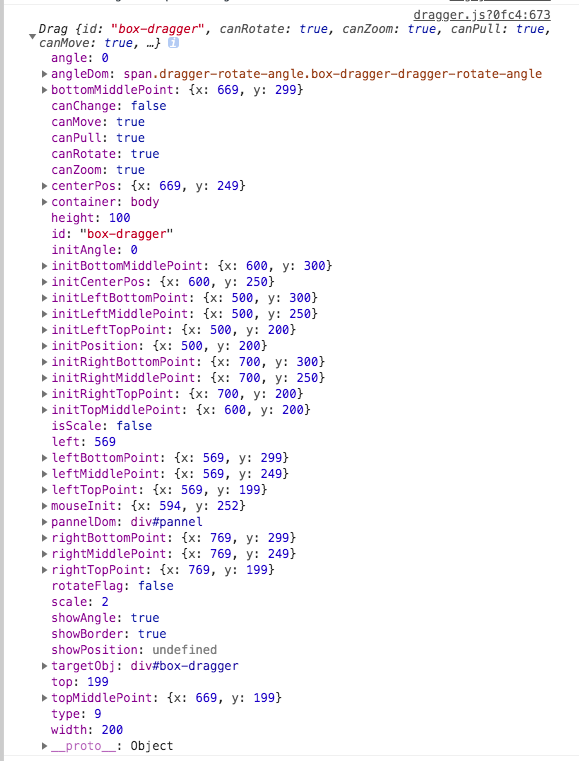

# 拖拽功能封装：
## 功能细节整理：
- 旋转
- 缩放
- 平移

## 技术难点：
- 旋转时要注意盒子每一个点的位置发生了变化
- 针对旋转后的盒子的left和top都有变化，计算其left和top时需将其按照中心轴旋转摆正，再进行计算
- 实现的两种不同方式：
	- 可以选中某元素，直接给该元素内部加上操作的点
	- 有一个pannel，选中某元素时，将这个pannel定位到该元素的位置上
	
这两种方式都实现过一次，第一种比较简单，但是第一种，不好控制选中某个元素才让操作点展示。且，不好做到合并两个box，组合一起拖拽。

## 如何封装：

考虑如何让用户快速上手使用，可参考的点：

- 传入什么参数进去
- 暴露给用户什么可设置的参数和方法

## 封装难点
- 当前页面多个实例化dragger时，如何保证操作互不影响

## 实现过程
### 可配置参数
- id 目标元素id
- container 父容器id
- canRotate 是否可以旋转
- canZoom 是否可以缩放
- canPull 是否可以拉升
- canMove 是否可以平移
- showAngle 展示角度
- showPosition 展示位置
- isScale 是否等比例缩放
- showBorder 是否展示pannel的border

### 属性
- canRotate
- canZoom
- canPull
- canMove
- showAngle
- isScale
- id
- container
- targetObj
- pannelDom 操作divdom
- ...

具体看图：

